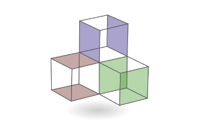

# Joint inversions with the SimPEG framework

_Joseph Capriotti, Lindsey J. Heagy and Santiago Soler_

## Summary 

Joint inversions seek to take advantage of the multiple geophysical surveys to produce spatially consistent results. There are many different approaches to joint inversion that all have their own characteristics. Performing a joint inversion is normally a cumbersome process that does not allow the practitioner to easily test different joint inversion methods. We have extended the open source python package SimPEG’s modular framework to support several different methods of joint inversion that can be used interchangeably, notably cross-gradient, joint total variation, and petrophysically guided inversion. We use this framework to investigate gravity and magnetic joint inversion characteristics for a mining carbon mineralization project that is searching for serpentinized rock. The framework allowed for us to rapidly produce different joint inversion algorithms for each method with minimal differences between the three codes. All of the joint inversions were successful at producing strongly correlated density and susceptibility models. These unified models allow us to have a higher confidence in the interpretations.

## Citation 

''' 

Joseph Capriotti, Lindsey J. Heagy, and Santiago Soler, (2023), "Joint inversions with the SimPEG framework," SEG Technical Program Expanded Abstracts : 1678-1682.
https://doi.org/10.1190/image2023-3910791.1

'''